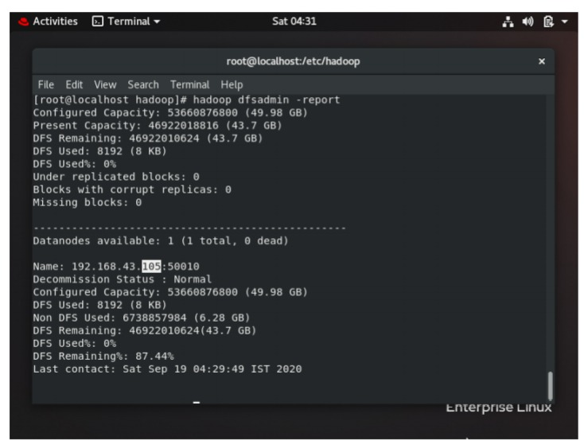

# Idea of Super Computers: A model of master-salve topology.

- [x] __IS BIG DATA A TECHNOLOGY?__
- [x] __VOLUME and VELOCITY:__
- [x] __DISCOVERY OF SUPER COMPUTERS.__
- [x] __Facts__

*As a matter of fact, Facebook handles 105 petabytes of data every hour, which is roughly 100 million gigabytes.
*So, how this huge bulk of data is getting managed. Is it because there is massive hard disk available to store data?
*The above problem is known as #BIGDATA.
*So, bigdata is not a technology. It’s a problem we have to overcome with technology.

The solution is DISTRIBUTED STORAGE: DISCOVERY OF SUPER COMPUTERS.

